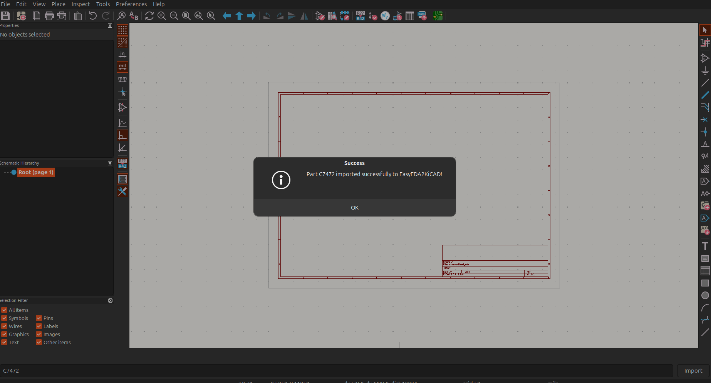
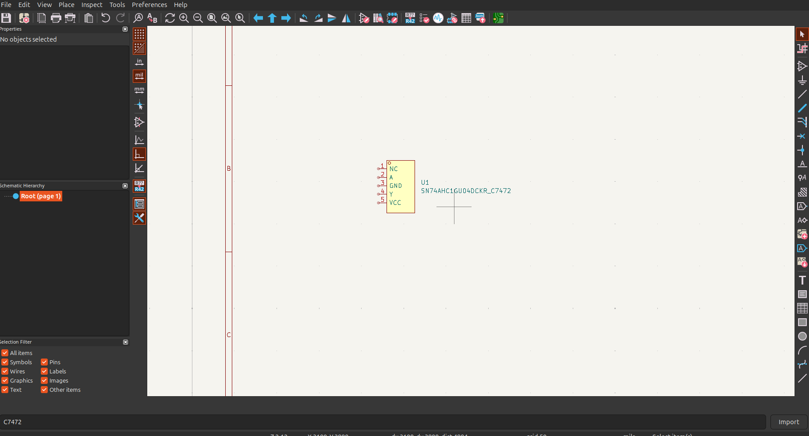

# EasyEDA to KiCad Plugin

This repository contains a **KiCad plugin** that helps you import **EasyEDA** components from **LCSC** directly into KiCad using the `easyeda2kicad` Python library. This plugin streamlines the process of integrating EasyEDA parts into your KiCad schematics.

## Installation

### Prerequisites
- Install **KiCad** before proceeding.
- KiCAD must be close until the instruction says open it.

### Windows Installation
1. Clone the repository or download the ZIP file.
2. Run the `installer-windows.bat` file included in the repository.
3. Follow the instructions in the terminal.
4. If you don't have `pipx` installed, the script will install it for you. Afterward, **rerun the `.bat` file** to complete the setup.

### Ubuntu Installation
1. Clone the repository or download the ZIP file.
2. Open your terminal from the directory you clone the repository and run the following command:
   ```bash
   chmod +x installer-ubuntu.sh uninstaller-ubuntu.sh
   ./installer-ubuntu.sh
   ```
3. This command will install `pipx` and may require you to close and reopen the terminal (to refresh the environment).
4. After reopening the terminal, rerun the script:
   ```bash
   ./installer-ubuntu.sh
   ```

### Handling Configuration Issues
If you encounter the following warning:
```
❗ KiCad configuration file not found. Please open KiCad, go to Preferences → Configure Paths, click OK, then rerun this script.
```
This occurs because you haven't created a KiCad project yet. Create a new project in KiCad to ensure that the `sym-lib` and `fp-lib` files are generated, then rerun the script.

## Important Note About Libraries
During the installation, the script will download the KiCad library folder into your **Documents** folder. To avoid overwriting or losing your existing libraries:
- If you wish to keep your previous libraries, you can move them to the new KiCad library folder created during installation.
- Alternatively, back up your existing library folder before running the installation script to prevent data loss.

## Finalizing Installation in KiCad
1. Open **KiCad**.
2. Go to **Preferences** in the top menu and select **Configure Tools**.
3. If you see **EASYEDA2KICAD** listed, you're almost done.
4. Now go to **Tools → Plugin and Content Manager**.
5. Click **Install from File** and select the **ZIP file** generated by the `installer` script.
6. The plugin should now be successfully installed.

## Usage
- To convert parts from **LCSC** to a KiCad library, enter the LCSC part number in the format: `Cxxxx`.
- To insert a textbox into your schematic, ensure that the **PCB layout** is opened when using the plugin.

> **Note:** In future versions, the textbox insertion process may be improved for better usability.

## Results
Below are some example images showing the successful output of the plugin:





## Troubleshooting
- If the plugin fails to show up after installation:
  - Verify your KiCad installation.
  - Ensure you followed the setup steps correctly.
  - Confirm that your environment variables are properly refreshed after running the script.

## Future Improvements
- Automating the textbox insertion process is planned for future updates.

## Contact
For questions, support, or feature requests, feel free to reach out via GitHub:
- [GitHub Profile](https://github.com/onurkarakoc79)

---

If you encounter any issues or have suggestions for improvements, feel free to open an issue on this repository. Happy designing! 🚀

